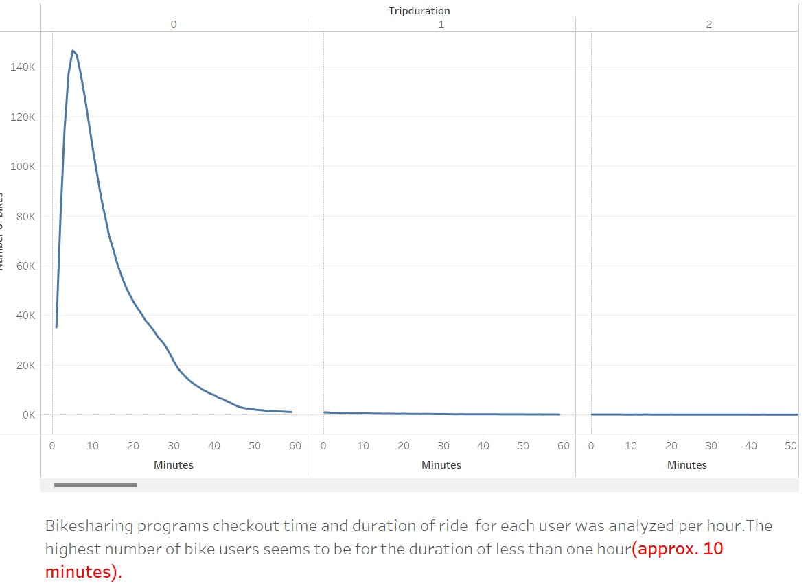
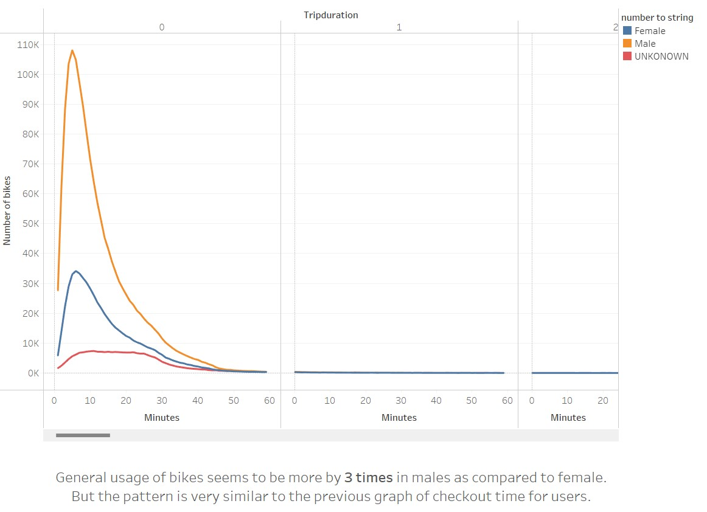
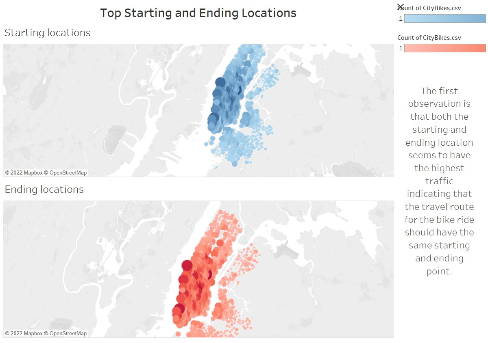
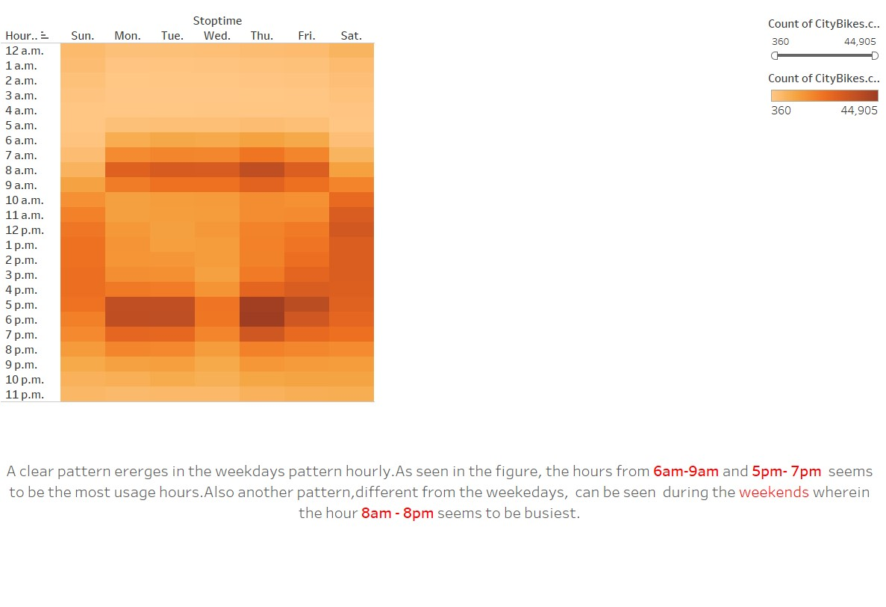
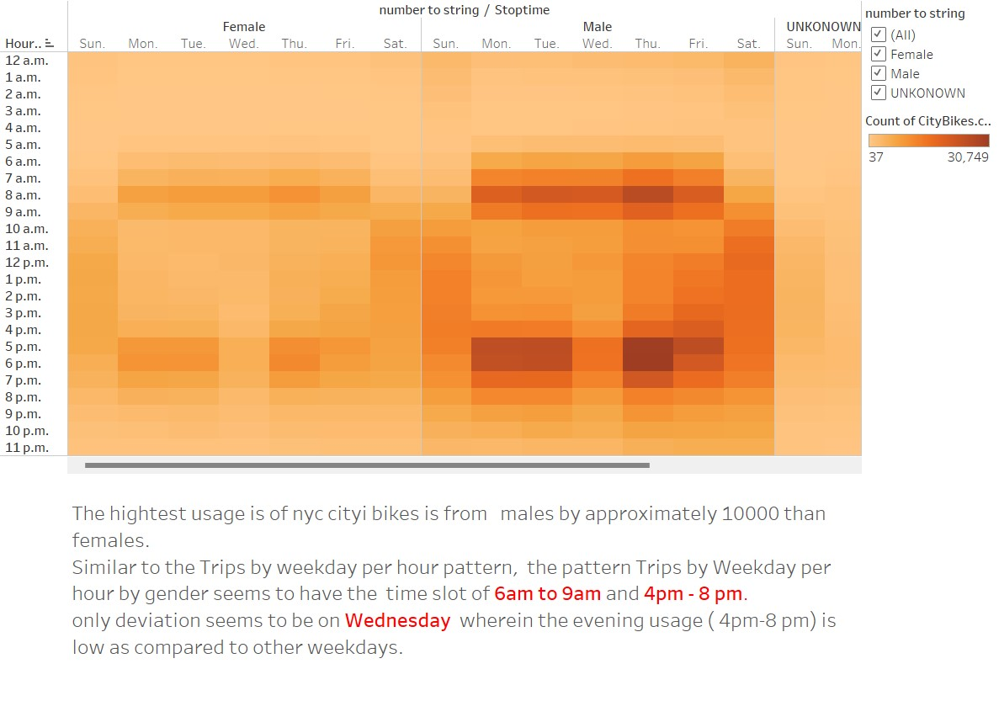
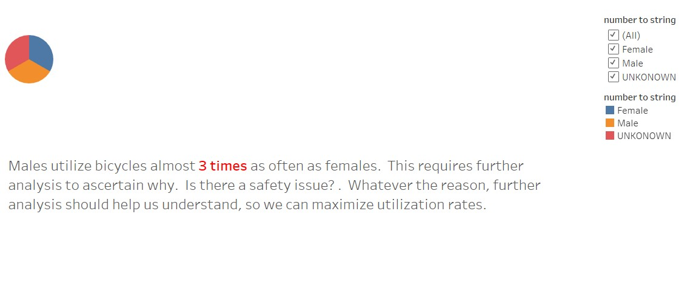
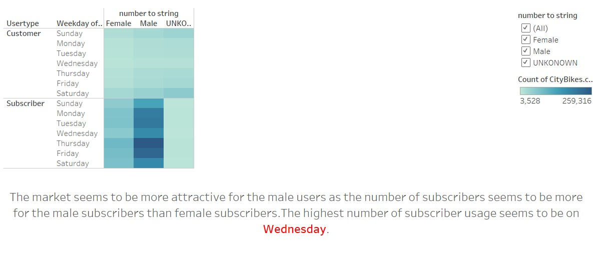

# Bikesharing

## Purpose

Citi Bike is the nation's largest bike share program, with 20,000 bikes and over 1,300 stations across Manhattan, Brooklyn, Queens, the Bronx and Jersey City. It was designed for quick trips with convenience in mind, and it’s a fun and affordable way to get around town.

Looking at the breadth of data provided by Citi Bike one can examine if a bike-sharing program in another city is a solid business proposal. Citi Bike data can examine how many people use Citi Bike, when they ride, how far do they go, what is the gender breakdown of bike use and what days of the week are most rides taken on?

## Results

#### Links
[link to dashboard](https://public.tableau.com/app/profile/tushar.shivakumar/viz/NYC_CITIBIKE_VISUALIZATIONS/Storyboard?publish=yes)

## Summary
The trends found in the visualizations indicate clearly that the NYCS bike shares program could be a huge success in an active population.Des moines seems to be a good prospect for this program.Althought the following suggestions have to be thought about:
* An analysis of an active population vs the population of the state needs to be graphed to understand what sort of market strategy the company needs for the specific city.
* An additional vizualization between average trip duration, by birth year, by gender, to explore if there was any difference in male or female or un-gendered riders as they age.  
